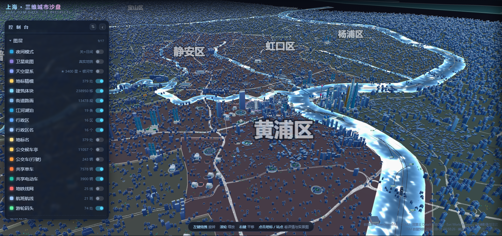
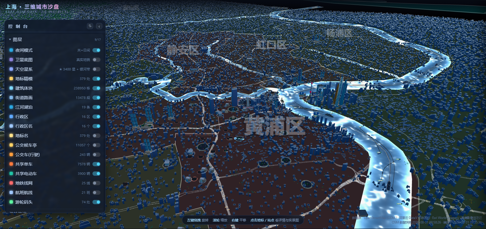

# 上海 · 三维城市数字沙盘

基于 **three.js** 的上海市全境三维可视化沙盘。1 场景单位 = 1 km，覆盖全市 16 区：建筑体块、地标精模、江河湖泊、地铁公交、游轮码头、航班航线、共享单车、真实照片与百科简介。

零构建、零运行时依赖 —— 一条命令跑起来。

| 日间全景 | 夜间模式 |
|---|---|
|  |  |

地标信息卡内的**真实照片**由多源回退链提供（高德 POI 实景 / 快懂百科 / 必应 / Wikimedia）， Key 只存服务端：


```bash
node server.js          # 打开 http://127.0.0.1:8080
node server.js 3000     # 指定端口
```

---

## 一、功能一览

| 模块 | 内容 |
|---|---|
| 建筑体块 | 约 **24 万栋**（OSM 全市分片体块合并，单 draw call 的 InstancedMesh） |
| 地标精模 | **379 座**手工建模地标（外滩万国建筑群、豫园、武康大楼、中华艺术宫…），每座自带石材广场垫层 |
| 地铁线网 | 25 条线路、**453 座车站**，线路号徽标 + 站牌，LOD 分级显现 |
| 公交系统 | 8 种车型（含双层/电车/铰接）沿真实线路行驶，沿线候车亭 |
| 共享单车/电动车 | 三品牌涂装，地铁口/公交站簇状停放 |
| 游轮码头 | 74 处码头（16 客运港 + 50 渡口），刻名铭牌、波浪雨棚、船行尾迹 |
| 航班航线 | 航线飞行 + 加色辉光管 |
| 江河湖泊 | 黄浦江/苏州河等按真实宽度生成的水面着色器 |
| 天空系统 | 按地理经纬度与真实时间推算日月位置，含银河/流星/昼夜切换 |
| 实景影像 | Esri World Imagery + 高德卫星/注记/路网瓦片客户端合成 |
| 真实照片 | 多源回退链（详见第三节），含百科简介 |
| 交互 | 16 个图层开关、区划抽屉、POI 检索、信息卡、视角飞行、街景嵌入 |

左侧控制台可逐层开关，滚轮缩放、右键平移，点击任意要素打开信息卡。

---

## 二、数据来源

| 数据 | 来源 |
|---|---|
| 行政区划 | 阿里云 DataV.GeoAtlas |
| 建筑/道路/水系/POI | OpenStreetMap（Overpass API） |
| 实景影像底图 | Esri World Imagery、高德卫星/注记/路网瓦片 |
| 真实照片与百科 | Wikimedia Commons、维基百科、高德 POI、快懂百科、必应图片 |
| 坐标系 | OSM 为 WGS-84，高德瓦片为 GCJ-02，地标点位逐点校正 |

数据编译脚本：`build_data.py`（重新编译会更新 `data/*.json`）。

---

## 三、真实照片的多源回退

打开任意地标的信息卡，照片区按以下顺序自动回退，**谁先命中谁出图**：

| 优先级 | 来源 | 是否需要 Key |
|---|---|---|
| 1 | Wikimedia / 维基百科（P18、条目配图、Commons） | 否，但国内直连通常不可达 |
| 2 | **高德 POI 实景图**（按 POI 检索，相关性最强） | 需要 `AMAP_KEY` |
| 3 | 快懂百科词条图 | 否 |
| 4 | 必应图片（引号精确搜索 + 标题相关性过滤） | 否 |
| 5 | 百度百科 / 搜狗百科 | 否 |

设计原则是**宁缺毋滥**：找不到严格相关的图就显示街景入口，不塞错图。

### 配置高德 Key（可选，但强烈建议）

有 Key 后，1687 个 POI（含最冷门的小南门警钟楼、东方乐器博物馆等）都能出实景图，实测覆盖率 100%。没 Key 也能跑，只是冷门地标可能只显示街景入口。

```bash
# 方式一：环境变量（推荐，便于部署）
set AMAP_KEY=你的Key            # Windows
export AMAP_KEY=你的Key         # macOS / Linux
node server.js

# 方式二：写入文件（仅本地，已在 .gitignore 中）
echo 你的Key > data/amap_key.txt
node server.js
```

免费申请：<https://console.amap.com/dev/key/app> → 创建应用 → Key 类型选 **Web服务**。

---

## 四、⚠️ Key 安全须知

**任何时候都不要把 Key 写进前端 JS、HTML 或提交到 Git。**

本项目的 Key 只会在**服务端**（`server.js`）使用，浏览器始终看不到：

```
浏览器  →  /api/photo?q=外滩  →  server.js（服务端持有 Key）  →  高德 API
        ←  照片列表          ←                              ←
```

已内置的保护：

- `data/amap_key.txt`、`.env`、`*.key` 等已在 `.gitignore` 中，不会被提交
- 静态服务对 `.txt/.key/.env/.ini/.conf/.pem` 一律返回 **403**，防止 `data/` 目录下的密钥文件被 HTTP 直接下载
- 图片代理 `/api/img` 有域名白名单，防 SSRF

**如果 Key 曾经被提交进 Git 历史或写进前端代码，请立即到高德控制台删除并重新申请。**

---

## 五、部署

### 5.1 GitHub Pages（纯静态，零成本）

GitHub Pages 只托管静态文件，**不运行 `server.js`**。部署后页面可正常浏览，但：

- ✅ 三维场景、所有图层、交互、信息卡：全部正常
- ⚠️ 照片 API（`/api/photo`、`/api/img`）不存在 → 照片只能走 Wikimedia（观众需能直连维基），国内观众会看到街景入口提示

部署步骤：

```bash
git add -A
git commit -m "deploy: 上海三维城市沙盘"
git remote add origin https://github.com/Vogadero/ThreeD.git
git push -u origin main
```

然后到仓库 **Settings → Pages → Build and deployment**：
- Source 选 `Deploy from a branch`
- Branch 选 `main` / 根目录 `/` → Save

几分钟后访问：`https://vogadero.github.io/ThreeD/`

> 根目录已放 `.nojekyll`，避免 Jekyll 忽略 `_` 开头与 `vendor/` 目录。

### 5.2 想让 Pages 上的国内观众也看到照片（可选升级）

项目已附带一份 **Cloudflare Worker 脚本**（`deploy/worker.js`），它就是给 Pages 用的“服务端”。免费额度对个人项目绰绰有余（每天 10 万次请求）。

**第一步：部署 Worker（约 5 分钟）**

1. 注册 <https://dash.cloudflare.com>（免费）→ 左侧 **Workers 和 Pages** → **创建** → **创建 Worker**
2. 起个名字（如 `shanghai-photo`）→ **部署** → 点 **编辑代码**
3. 把 `deploy/worker.js` 的内容**全选粘贴**进去，覆盖默认代码 → 点 **部署**
4. 到 **设置 → 变量和机密** → 添加两个变量：
   - `AMAP_KEY` = 你的高德 Key（建议点“加密”）
   - `ALLOW_ORIGIN` = `https://vogadero.github.io`（只允许你的站点调用，别留 `*`）
5. 回到概览页，复制 Worker 地址，形如 `https://shanghai-photo.<你的账号>.workers.dev`

访问 `https://<你的地址>/` 应返回：

```json
{"service":"shanghai-3d photo api","ok":true,"amap":"configured"}
```

**第二步：让前端指向它**

在 `index.html` 的 `<head>` 里加一行（位置见文件内的注释）：

```html
<script>window.__PHOTO_API = 'https://shanghai-photo.<你的账号>.workers.dev/api/photo';</script>
```

然后重新 `git push`，等 Pages 重建即可。

> 图片 URL 由 Worker 直接返回原始地址，浏览器 `` 加载不受 CORS 限制，因此 Worker 不需要做图片代理，也不消耗额外流量。
> 本地开发不配置 `window.__PHOTO_API` 时，前端自动走同源 `/api/photo`，两边互不影响。

---

## 六、目录结构

```
shanghai-3d/
├── index.html          页面骨架 + 全部 CSS（控制台/抽屉 UI）
├── server.js           静态服务器 + 照片多源 API（纯 Node 内置模块, 零依赖）
├── src/
│   ├── main.js         入口: 渲染循环、图层开关、点击拾取
│   ├── basemap.js      底图瓦片与 Y 轴层高基准
│   ├── buildings.js    24 万栋建筑体块合并
│   ├── landmarks.js    379 座地标精模
│   ├── transit.js      地铁/公交/候车亭
│   ├── mobility.js     共享单车、电动车、公交车型
│   ├── cruise.js       游轮、渡轮、码头
│   ├── aviation.js     航班航线
│   ├── water.js        水面着色器
│   ├── sky.js          日月星空
│   ├── districts.js    行政区色块与名称
│   ├── ui.js           控制台/抽屉/信息卡
│   ├── wikimedia.js    照片多源链（含维基可达性门控）
│   └── photos.js       卫星影像拼贴
├── data/               编译好的 JSON 数据（.gitignore 排除密钥文件）
├── assets/tiles/       实景影像瓦片（14×18, zoom 12）
├── vendor/three/       three.js r169 + addons（勿删）
└── build_data.py       数据编译脚本
```

---

## 七、常见问题

**页面白屏 / three.js 加载失败**
`vendor/three/addons/utils/BufferGeometryUtils.js` 是必需的（构建时用到 `mergeGeometries`），删掉会导致 `import` 失败白屏。

**改了代码没生效**
浏览器按 `?v=N` 缓存 ES 模块，改动模块后请把 `src/main.js` 与 `index.html` 里的 `?v=N` 递增（当前 `?v=58`）。

**改了 server.js 没生效**
Node 服务没有热重载，必须重启进程。

**照片区提示"服务器未开启照片 API"**
纯静态部署（如 GitHub Pages）没有服务端，属正常现象，见 5.2 的升级方案。

**提示"无法连接 Wikimedia"但国内源也没图**
该地标较冷门，免费源未收录其图片；配置 `AMAP_KEY` 可覆盖全部 POI。

---

## 八、许可与署名

代码可自由使用与修改。地图数据 © OpenStreetMap contributors（ODbL），影像瓦片 © Esri / 高德，照片版权归各自作者（Wikimedia 内容多为 CC BY-SA）。若要公开部署，请保留来源署名。
